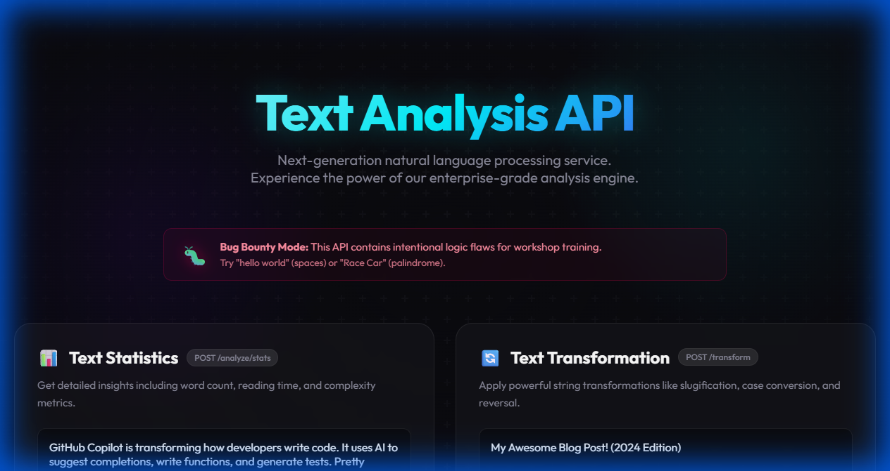
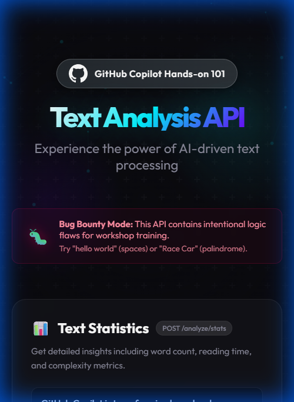

# 🔍 Text Analysis API

> **TL;DR**: A text analysis API with **intentional bugs**. You'll use GitHub Copilot to find bugs, write tests, and improve the code. It's like a puzzle, but for developers.

---

## 👨‍💻 Developed by **Yuval Avidani**

> **AI Expert | GitHub Star ⭐ | Founder of YUV.AI**

Connect with me:
- 🌐 **Website:** [yuv.ai](https://yuv.ai)
- 🐙 **GitHub:** [@hoodini](https://github.com/hoodini)
- 💼 **LinkedIn:** [Yuval Avidani](https://www.linkedin.com/in/yuvalavidani)

---

## 📸 App Screenshots

### Desktop Preview


### Mobile Glassmorphism


---

## 🚀 Workshop Instructions
1.  **Run the App**: `npm run dev`
2.  **Open in Browser**: `http://localhost:3000`
3.  **Find Bugs**: Use GitHub Copilot to identify and fix the intentional logic errors in `src/index.js`.
 It's like a puzzle, but for developers.

---

## 🤔 Wait, What Does This Actually Do?

Ever wondered how apps do these things?

| Real-World Feature | This API Does It |
|-------------------|------------------|
| **Medium/Dev.to** showing "5 min read" | `POST /analyze/stats` → calculates reading time |
| **WordPress** creating URL slugs from titles | `POST /transform` → "My Blog Post!" → `my-blog-post` |
| **Twitter/X** counting characters | `POST /analyze/stats` → character count |
| **Grammarly** detecting sentence count | `POST /analyze/stats` → sentence analysis |
| **Form validation** checking emails | `POST /validate` → email/URL validation |
| **Comment moderation** on Reddit/YouTube | `POST /validate` → profanity detection |
| **Amazon reviews** - is this positive? | `POST /analyze/sentiment` → positive/negative/neutral |
| **SEO tools** finding keyword density | `POST /analyze/stats` → most frequent word |

---

## 🎮 Try It Right Now

```bash
# Clone and run (takes 30 seconds)
git clone https://github.com/hoodini/copilot-workshop-text-analysis.git
cd copilot-workshop-text-analysis
npm install
npm start
```

### 🖥️ Open the Visual UI

Go to **http://localhost:3000** - you'll see an interactive dashboard to test all features!


### Or use curl/Postman:

### 📖 "How long will this article take to read?"
```bash
curl -X POST http://localhost:3000/analyze/stats \
  -H "Content-Type: application/json" \
  -d '{"text": "Artificial Intelligence is transforming how we write code. GitHub Copilot uses large language models to suggest code completions, write functions, and even generate tests. In this workshop, you will learn how to leverage AI to become a more productive developer. The future of coding is here, and it is powered by AI assistants that understand your intent and help you write better code faster."}'
```
**→ Returns**: `readingTimeMinutes: 1, wordCount: 71`

### 🔗 "Turn my blog title into a URL"
```bash
curl -X POST http://localhost:3000/transform \
  -H "Content-Type: application/json" \
  -d '{"text": "10 Tips to Master GitHub Copilot! (2024 Edition)", "operation": "slug"}'
```
**→ Returns**: `"10-tips-to-master-github-copilot-2024-edition"`

### 😊 "Is this Amazon review positive or negative?"
```bash
curl -X POST http://localhost:3000/analyze/sentiment \
  -H "Content-Type: application/json" \
  -d '{"text": "This product is amazing! Best purchase I ever made. The quality is excellent and shipping was fast. Highly recommend!"}'
```
**→ Returns**: `sentiment: "positive", score: 3`

### 🔄 "Is this word a palindrome?" (Try to find the bug!)
```bash
# This works:
curl -X POST http://localhost:3000/validate \
  -H "Content-Type: application/json" \
  -d '{"text": "racecar", "type": "palindrome"}'
# → isValid: true ✅

# But this SHOULD work and doesn't (BUG!):
curl -X POST http://localhost:3000/validate \
  -H "Content-Type: application/json" \
  -d '{"text": "Race Car", "type": "palindrome"}'
# → isValid: false ❌ (should be true!)
```

### ✉️ "Is this email address valid?"
```bash
curl -X POST http://localhost:3000/validate \
  -H "Content-Type: application/json" \
  -d '{"text": "hello@world", "type": "email"}'
```
**→ Returns**: `isValid: false` (missing TLD like .com)

---

## 🎯 Why This Project Exists

### This isn't another boring tutorial.

**I wrote code with intentional bugs.** Your job is to use **GitHub Copilot** to:

1. 🧪 **Generate tests** → Watch them fail and expose the bugs
2. 🔧 **Fix the bugs** → Make the tests pass
3. 🏗️ **Refactor** → Transform messy Express.js into clean NestJS
4. ⚡ **Optimize** → Find the O(n²) algorithm and fix it
5. 📝 **Document** → Auto-generate JSDoc, Swagger, Mermaid diagrams

**It's like a code escape room.** 🔓

---

## 🐛 The Bugs (Spoiler Alert!)

Don't read this if you want to discover them yourself!

<details>
<summary>🔍 Click to reveal the intentional bugs</summary>

### Bug 1: Word Counter Fails on Multiple Spaces
```javascript
// Current code:
text.split(' ').length  // "hello    world" → 5 words (WRONG!)

// Should be:
text.split(/\s+/).filter(Boolean).length  // "hello    world" → 2 words ✓
```

### Bug 2: Sentence Counter Ignores ? and !
```javascript
// Current code:
text.split('.').length  // "Hello! How are you?" → 1 sentence (WRONG!)

// Should split on: . ? and !
```

### Bug 3: Palindrome is Case-Sensitive and Space-Sensitive
```javascript
// "RaceCar" returns false (WRONG - should be true)
// "A man a plan a canal Panama" returns false (WRONG!)
// Needs to: lowercase + remove spaces before comparing
```

### Bug 4: O(n²) Most Frequent Word Algorithm
```javascript
// Current: Nested loops - checks every word against every other word
// Should use: Hash map (object/Map) for O(n) complexity
```

</details>

---

## 🗺️ How It Works

```
┌─────────────┐     HTTP      ┌──────────────────────┐
│  Your App   │──────────────▶│  Text Analysis API   │
│  (Client)   │◀──────────────│     (Express.js)     │
└─────────────┘     JSON      └──────────────────────┘
                                        │
                    ┌───────────────────┼───────────────────┐
                    ▼                   ▼                   ▼
             ┌──────────┐       ┌──────────────┐    ┌─────────────┐
             │ 📊 Stats │       │ 🔄 Transform │    │ ✅ Validate │
             │ endpoint │       │   endpoint   │    │  endpoint   │
             └──────────┘       └──────────────┘    └─────────────┘
                    │                   │                   │
                    ▼                   ▼                   ▼
              • Word count       • To slug           • Email check
              • Sentences        • To uppercase      • URL check
              • Read time        • To lowercase      • Palindrome
              • Frequent word    • To camelCase      • Profanity
```

---

## 📡 All API Endpoints

| Method | Endpoint | What It Does | Example Use Case |
|--------|----------|--------------|------------------|
| `GET` | `/health` | Health check | Load balancer probes |
| `POST` | `/analyze/stats` | Word count, sentences, reading time | Blog "5 min read" |
| `POST` | `/transform` | Slug, case conversion, reverse | URL generation |
| `POST` | `/validate` | Email, URL, palindrome check | Form validation |
| `POST` | `/analyze/sentiment` | Positive/negative/neutral | Review analysis |

---

## 🎓 Workshop: What You'll Actually Do

### Phase 1: Break Things with Tests (30 min)
Ask Copilot to write tests → Tests fail → You found bugs!

**Copy this prompt into Copilot Chat:**
```
Generate unit tests for the countWords function with edge cases:
- Empty string
- Multiple spaces between words ("hello    world")
- Tabs and newlines
- Just whitespace ("     ")
```

### Phase 2: Fix the Bugs (20 min)
Now you know what's broken. Fix it!

**Prompt:**
```
The countWords function fails when there are multiple spaces.
Fix it to handle multiple spaces, tabs, and newlines correctly.
```

### Phase 3: Refactor to NestJS (45 min)
Transform spaghetti Express.js into proper architecture.

**Prompt:**
```
Refactor this Express.js app to NestJS with:
- TextAnalysisModule
- TextAnalysisController  
- TextAnalysisService
- DTOs with validation
```

### Phase 4: Kill the O(n²) Monster (15 min)
There's a terribly slow algorithm hiding in the code. Find and fix it.

**Prompt:**
```
The findMostFrequentWord function is O(n²). 
Optimize it to O(n) using a hash map.
```

### Phase 5: Add the Professional Stuff (20 min)
Dockerfile, Swagger docs, logging - the things real apps need.

**Prompt:**
```
Create a multi-stage Dockerfile optimized for production
with non-root user and health check.
```

---

## 🧪 Run the Tests (See the Failures!)

```bash
npm test
```

You'll see something like:
```
 FAIL  test/sample.test.js
  countWords
    ✓ returns 0 for empty string
    ✓ counts single word  
    ✕ handles multiple spaces between words    ← BUG!
    ✕ handles tabs                              ← BUG!
    
  isPalindrome
    ✓ returns true for simple palindrome
    ✕ ignores case                              ← BUG!
    ✕ ignores spaces                            ← BUG!
```

**Those red ✕ marks are not your fault - they're the bugs we planted!** 🎉

---

## 📚 Workshop Materials

| File | What's Inside |
|------|---------------|
| 📋 [docs/PROMPTS_LIBRARY.md](./docs/PROMPTS_LIBRARY.md) | **40+ copy-paste prompts** for every exercise |
| 📅 [docs/COPILOT_101_WORKSHOP.md](./docs/COPILOT_101_WORKSHOP.md) | Full workshop schedule & agenda |
| 🎯 [docs/QUICK_REFERENCE.md](./docs/QUICK_REFERENCE.md) | Print this! One-page cheat sheet |
| 🦊 [docs/GITLAB_GUIDE.md](./docs/GITLAB_GUIDE.md) | Step-by-step GitLab instructions |
| 🤖 [llms.md](./llms.md) | Instructions for AI coding assistants |

---

## 🚀 Commands Cheat Sheet

```bash
npm install        # Install dependencies
npm start          # Run server at localhost:3000
npm test           # Run tests (expect failures!)
npm run dev        # Run with auto-reload
```

---

## 🤝 Who Is This For?

✅ **Workshop facilitators** teaching GitHub Copilot  
✅ **Developers** wanting hands-on AI coding practice  
✅ **Teams** learning test-driven development  
✅ **Bootcamp instructors** needing practical exercises  
✅ **Anyone** who learns by doing, not just reading  

---

## 📄 License

MIT - Use it, fork it, run workshops with it, make it better!

---

<p align="center">
  <b>Ready to find some bugs? 🐛</b>
  <br><br>
  <code>git clone https://github.com/hoodini/copilot-workshop-text-analysis.git</code>
  <br><br>
  <a href="./docs/PROMPTS_LIBRARY.md">📋 Get the Copilot prompts</a> · 
  <a href="./docs/COPILOT_101_WORKSHOP.md">📅 Workshop guide</a>
</p>
