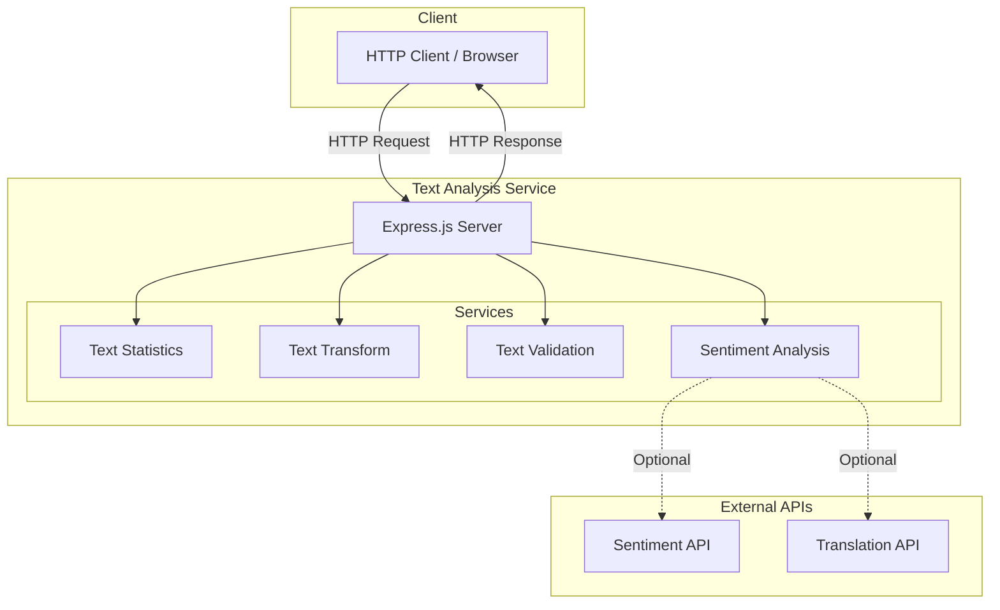
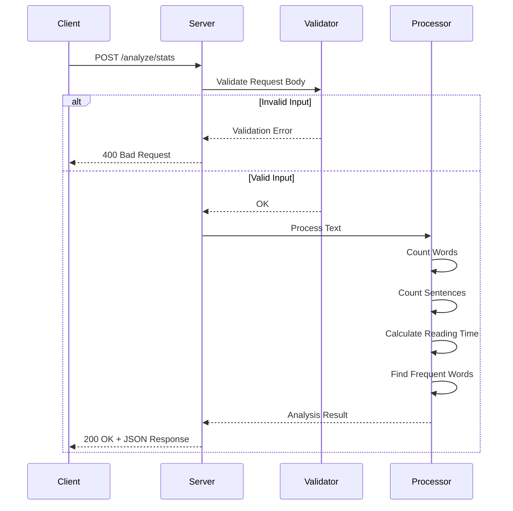
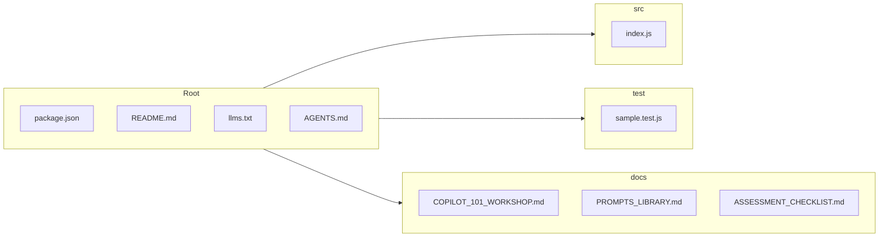

# � Text Analysis Service

[](https://github.com/YOUR_ORG/text-analysis-service/actions)
[](https://opensource.org/licenses/MIT)
[](https://nodejs.org)

> A REST API for text analysis, transformation, and validation - designed as a teaching tool for **GitHub Copilot workshops**.

## 🎯 Purpose

This project serves as a hands-on learning environment for developers to practice using **GitHub Copilot** for:

- 🧪 Generating unit tests with edge cases
- 🔄 Refactoring code (Express.js → NestJS)
- ⚡ Optimizing algorithms
- 🐳 Creating Docker configurations
- 📚 Auto-generating documentation
- 📝 Implementing structured logging
- 🔗 Writing integration tests

---

## 📐 Architecture



---

## 🔄 Request Flow



---

## 📦 Project Structure



---

## 🚀 Quick Start

### Prerequisites

- Node.js 18 or higher
- npm or yarn
- VS Code with GitHub Copilot extension

### Installation

```bash
# Clone the repository (GitHub)
git clone https://github.com/YOUR_ORG/text-analysis-service.git

# OR Clone from GitLab
git clone https://gitlab.com/YOUR_ORG/text-analysis-service.git

# Navigate to the project
cd text-analysis-service

# Install dependencies
npm install

# Start the server
npm start
```

The server will start at `http://localhost:3000`

---

## 📡 API Endpoints

| Method | Endpoint | Description |
|--------|----------|-------------|
| `GET` | `/health` | Health check |
| `POST` | `/analyze/stats` | Get text statistics |
| `POST` | `/transform` | Transform text |
| `POST` | `/validate` | Validate text format |
| `POST` | `/analyze/sentiment` | Analyze sentiment |
| `POST` | `/translate` | Translate text |

### Examples

#### Get Text Statistics

```bash
curl -X POST http://localhost:3000/analyze/stats \
  -H "Content-Type: application/json" \
  -d '{"text": "Hello world. This is a test. How are you?"}'
```

**Response:**
```json
{
  "wordCount": 9,
  "sentenceCount": 3,
  "characterCount": 43,
  "characterCountNoSpaces": 35,
  "readingTimeMinutes": 1,
  "mostFrequentWord": {
    "word": "is",
    "count": 1
  }
}
```

#### Transform Text

```bash
curl -X POST http://localhost:3000/transform \
  -H "Content-Type: application/json" \
  -d '{"text": "Hello World!", "operation": "slug"}'
```

**Response:**
```json
{
  "original": "Hello World!",
  "result": "hello-world",
  "operation": "slug"
}
```

#### Validate Email

```bash
curl -X POST http://localhost:3000/validate \
  -H "Content-Type: application/json" \
  -d '{"text": "user@example.com", "type": "email"}'
```

**Response:**
```json
{
  "text": "user@example.com",
  "type": "email",
  "isValid": true
}
```

---

## 🧪 Testing

```bash
# Run all tests
npm test

# Run tests in watch mode
npm run test:watch

# Run tests with coverage
npm run test:coverage
```

---

## 🐳 Docker

```bash
# Build the image
docker build -t text-analysis-service .

# Run the container
docker run -p 3000:3000 text-analysis-service
```

---

## 🎓 Workshop Materials

This project includes comprehensive workshop materials:

| Document | Description |
|----------|-------------|
| [COPILOT_101_WORKSHOP.md](./docs/COPILOT_101_WORKSHOP.md) | Workshop overview and schedule |
| [PROMPTS_LIBRARY.md](./docs/PROMPTS_LIBRARY.md) | Ready-to-use Copilot prompts |
| [ASSESSMENT_CHECKLIST.md](./docs/ASSESSMENT_CHECKLIST.md) | Participant progress tracker |
| [DUAL_REPO_SETUP.md](./docs/DUAL_REPO_SETUP.md) | GitHub/GitLab setup guide |

---

## 🐛 Known Issues (Intentional!)

These bugs exist for educational purposes - participants will discover and fix them:

1. **`countWords()`** - Doesn't handle multiple consecutive spaces
2. **`countSentences()`** - Only counts periods, ignores `?` and `!`
3. **`isPalindrome()`** - Case-sensitive, doesn't ignore spaces
4. **`findMostFrequentWord()`** - O(n²) complexity instead of O(n)

---

## 🤖 AI Assistance Files

This project includes files to help AI assistants:

- **[llms.txt](./llms.txt)** - Project overview for AI assistants
- **[AGENTS.md](./AGENTS.md)** - Guidelines for AI coding agents

---

## 📄 License

MIT License - Feel free to use for your own workshops!

---

<p align="center">
  Made with ❤️ for the developer community
</p>
