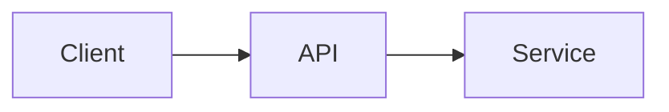

# LLM Instructions - Text Analysis Service

> This file provides guidance for AI coding assistants (GitHub Copilot, Claude, ChatGPT, Cursor, etc.) working on this project.

## 📋 Project Summary

| Item | Value |
|------|-------|
| **Name** | Text Analysis Service |
| **Type** | REST API |
| **Purpose** | Workshop demo for GitHub Copilot 101 |
| **Current Framework** | Express.js (legacy) |
| **Target Framework** | NestJS |
| **Language** | JavaScript → TypeScript |
| **Runtime** | Node.js 18+ |

## 🎯 What This Project Does

A text analysis API that provides:
- **Statistics**: Word count, sentence count, reading time
- **Transformation**: Slug, case conversion, reverse text
- **Validation**: Email, URL, palindrome detection
- **Analysis**: Sentiment analysis (mock external API)

## 🗂️ Project Structure

```
text-analysis-service/
├── src/
│   └── index.js              # Main application (Express.js)
├── test/
│   └── sample.test.js        # Sample unit tests
├── docs/                     # Workshop documentation
├── package.json              # Dependencies
├── llms.txt                  # Quick LLM reference
├── llms.md                   # This file (detailed)
├── AGENTS.md                 # AI coding guidelines
└── README.md                 # Project documentation
```

## 🚨 Important: Intentional Bugs

**DO NOT FIX THESE AUTOMATICALLY** - They exist for educational purposes!

| Function | Bug | Correct Behavior |
|----------|-----|------------------|
| `countWords()` | Uses `split(' ')` | Should use `split(/\s+/)` to handle multiple spaces |
| `countSentences()` | Only splits on `.` | Should split on `.`, `?`, `!` |
| `isPalindrome()` | Case-sensitive, includes spaces | Should ignore case and spaces |
| `findMostFrequentWord()` | O(n²) nested loops | Should use hash map for O(n) |

When asked to write tests, generate tests that **will reveal these bugs** (expect some to fail).

## 🔧 Common Tasks

### Running the Project

```bash
npm install      # Install dependencies
npm start        # Start server on port 3000
npm run dev      # Start with hot reload (nodemon)
npm test         # Run tests
```

### API Endpoints

```bash
# Health check
GET /health

# Text statistics
POST /analyze/stats
Body: { "text": "Your text here" }

# Transform text
POST /transform
Body: { "text": "Hello World", "operation": "slug" }
Operations: "slug", "case", "reverse"

# Validate text
POST /validate
Body: { "text": "test@example.com", "type": "email" }
Types: "email", "url", "palindrome", "profanity"

# Sentiment analysis
POST /analyze/sentiment
Body: { "text": "I love this!" }
```

## 📝 Code Style Guidelines

### DO:
- Use ES6+ syntax (const/let, arrow functions, async/await)
- Add JSDoc comments to all functions
- Keep functions small (max 20 lines)
- Write descriptive variable names
- Handle null/undefined inputs gracefully
- Include error handling

### DON'T:
- Use `var` (use `const` or `let`)
- Use callbacks when async/await is possible
- Leave console.log in production code
- Catch errors without handling them
- Use magic numbers without constants

### Example Function Style

```javascript
/**
 * Counts the number of words in a text string.
 * 
 * @param {string} text - The input text to analyze
 * @returns {number} The word count (0 if empty/null)
 * @example
 * countWords("Hello world") // returns 2
 */
function countWords(text) {
  if (!text || typeof text !== 'string') {
    return 0;
  }
  return text.trim().split(/\s+/).filter(Boolean).length;
}
```

## 🧪 Testing Guidelines

When generating tests:

1. **Include edge cases:**
   - Empty string `""`
   - `null` and `undefined`
   - Single item (one word, one character)
   - Multiple spaces, tabs, newlines
   - Unicode characters (Hebrew, Chinese, emojis)
   - Very long input

2. **Test naming convention:**
   ```javascript
   describe('functionName', () => {
     it('should return X when given Y', () => {
       // test
     });
   });
   ```

3. **Expect some tests to fail** - this reveals bugs in the code!

## 🔄 Refactoring to NestJS

When asked to refactor, create this structure:

```
src/
├── main.ts                           # Bootstrap
├── app.module.ts                     # Root module
├── text-analysis/
│   ├── text-analysis.module.ts       # Feature module
│   ├── text-analysis.controller.ts   # HTTP handlers
│   ├── text-analysis.service.ts      # Business logic
│   └── dto/
│       ├── analyze-stats.dto.ts      # Input validation
│       └── transform-text.dto.ts
└── common/
    ├── logger/                       # Winston logger
    └── filters/                      # Exception filters
```

### NestJS Conventions

- Use `@Injectable()` for services
- Use `@Controller()` for controllers
- Use `class-validator` decorators in DTOs
- Use `@nestjs/swagger` decorators for API docs

## 🐳 Docker Guidelines

When generating Dockerfile:

```dockerfile
# Use multi-stage build
# Stage 1: Install dependencies
# Stage 2: Production with minimal image

# Requirements:
- Node 20 Alpine base
- Non-root user
- Health check
- Only production dependencies in final image
```

## 📊 When Asked for Diagrams

Use Mermaid syntax:



## ⚠️ Things to Avoid

- Don't overwrite intentional bugs without explanation
- Don't add dependencies without justification
- Don't generate overly complex solutions
- Don't skip input validation
- Don't expose stack traces to clients
- Don't log sensitive data

## 🎓 Workshop Context

This is a **teaching project**. When helping:

1. **Explain** what the code does
2. **Show** best practices
3. **Generate** comprehensive tests
4. **Suggest** improvements but explain trade-offs
5. **Demonstrate** before/after comparisons

## 📚 Related Files

- [README.md](./README.md) - Full project documentation
- [AGENTS.md](./AGENTS.md) - Detailed AI coding guidelines
- [llms.txt](./llms.txt) - Quick reference for LLMs
- [docs/PROMPTS_LIBRARY.md](./docs/PROMPTS_LIBRARY.md) - Workshop prompts
