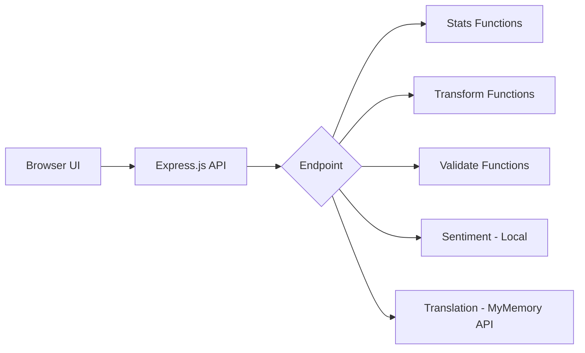

# LLM Instructions - Text Analysis Service

> This file provides guidance for AI coding assistants (GitHub Copilot, Claude, ChatGPT, Cursor, etc.) working on this project.

## 📋 Project Summary

| Item | Value |
|------|-------|
| **Name** | Text Analysis Service |
| **Type** | REST API + Interactive Web UI |
| **Purpose** | Workshop demo for GitHub Copilot 101 |
| **Current Framework** | Express.js (legacy) |
| **Target Framework** | NestJS |
| **Language** | JavaScript → TypeScript |
| **Runtime** | Node.js 18+ |
| **External APIs** | MyMemory Translation (free, no key) |
| **Sentiment** | Local word-matching algorithm |

## 🚀 Quick Start

```bash
# Clone and run
git clone https://github.com/hoodini/copilot-workshop-text-analysis.git
cd copilot-workshop-text-analysis
npm install
npm start

# Open UI: http://localhost:3000
# Run tests: npm test (expect 13 failures - they expose bugs!)
```

## 🎯 What This Project Does

A text analysis API with an **interactive glassmorphism web UI** that provides:

| Feature | Endpoint | Description |
|---------|----------|-------------|
| **Statistics** | `POST /analyze/stats` | Word count, sentence count, reading time, most frequent word |
| **Transform** | `POST /transform` | Slug, case conversion (upper/lower/title/camel), reverse |
| **Validate** | `POST /validate` | Email, URL, palindrome detection, profanity check |
| **Sentiment** | `POST /analyze/sentiment` | Local sentiment analysis (positive/negative/neutral) |
| **Translate** | `POST /translate` | Real translation via MyMemory API (free) |

## 🗂️ Project Structure

```
text-analysis-service/
├── src/
│   └── index.js                      # Main Express.js app + all functions
├── public/                           # Interactive web UI
│   ├── index.html                    # Dashboard with glassmorphism design
│   ├── style.css                     # Modern CSS styling
│   ├── main.js                       # UI JavaScript
│   └── assets/                       # Screenshots
├── test/
│   ├── sample.test.js                # Unit tests (13 intentional failures!)
│   ├── setup.js                      # Jest setup
│   └── integration/
│       └── api.integration.test.js   # Integration tests with nock mocking
├── docs/
│   ├── PROMPTS_LIBRARY.md            # 40+ copy-paste Copilot prompts
│   ├── COPILOT_101_WORKSHOP.md       # Full workshop schedule
│   └── QUICK_REFERENCE.md            # One-page cheat sheet
├── WORKSHOP.md                       # ⭐ START HERE - Step-by-step guide
├── package.json                      # Dependencies
├── jest.config.js                    # Jest configuration
├── llms.txt                          # Quick LLM reference
├── llms.md                           # This file (detailed)
├── AGENTS.md                         # AI coding guidelines
└── README.md                         # Project overview
```

## 🚨 Important: Intentional Bugs

**DO NOT FIX THESE AUTOMATICALLY** - They exist for educational purposes!

| Function | Bug | Correct Behavior |
|----------|-----|------------------|
| `countWords()` | Uses `split(' ')` | Should use `split(/\s+/)` to handle multiple spaces |
| `countSentences()` | Only splits on `.` | Should split on `.`, `?`, `!` |
| `isPalindrome()` | Case-sensitive, includes spaces | Should ignore case, spaces, and punctuation |
| `findMostFrequentWord()` | O(n²) nested loops | Should use hash map for O(n) |

When asked to write tests, generate tests that **will reveal these bugs** (expect some to fail).

## 🔧 Commands

```bash
npm install           # Install dependencies
npm start             # Start server (port 3000)
npm run dev           # Start with hot reload (nodemon)
npm test              # Run all tests
npm run test:watch    # Run tests in watch mode
npm run test:coverage # Run tests with coverage
npm run test:integration  # Run integration tests only
```

## 📡 API Reference

### Health Check
```bash
GET /health
# Returns: { "status": "ok", "timestamp": "2024-..." }
```

### Text Statistics
```bash
POST /analyze/stats
Content-Type: application/json
{ "text": "Hello world! How are you?" }

# Returns: wordCount, sentenceCount, characterCount, readingTimeMinutes, mostFrequentWord
```

### Transform Text
```bash
POST /transform
{ "text": "Hello World", "operation": "slug" }
# Operations: "slug", "case", "reverse"
# For case: { "options": { "targetCase": "upper|lower|title|camel" } }
```

### Validate Text
```bash
POST /validate
{ "text": "test@example.com", "type": "email" }
# Types: "email", "url", "palindrome", "profanity"
```

### Sentiment Analysis (Local)
```bash
POST /analyze/sentiment
{ "text": "This product is amazing! Best purchase ever!" }

# Returns: {
#   "score": 0.6,
#   "sentiment": "positive",
#   "source": "local",
#   "matchedWords": { "positive": ["amazing", "best"], "negative": [] }
# }
```

### Translation (MyMemory API - Free)
```bash
POST /translate
{ "text": "Hello world", "targetLanguage": "es" }

# Returns: {
#   "translatedText": "Hola mundo",
#   "source": "en",
#   "target": "es",
#   "apiSource": "mymemory"
# }
```

## 🧪 Testing

### Unit Tests
Located in `test/sample.test.js`. **13 tests intentionally fail** to reveal bugs:

```javascript
// Example: This test FAILS because countWords has a bug
it('handles multiple spaces between words', () => {
  expect(countWords('hello    world')).toBe(2);  // Returns 5, not 2!
});
```

### Integration Tests
Located in `test/integration/api.integration.test.js`. Uses **nock** to mock external APIs:

```javascript
const nock = require('nock');

// Mock MyMemory translation API
nock('https://api.mymemory.translated.net')
  .get('/get')
  .query({ q: 'Hello', langpair: 'en|es' })
  .reply(200, {
    responseStatus: 200,
    responseData: { translatedText: 'Hola' }
  });
```

### Test Commands
```bash
npm test                      # Run all tests
npm run test:integration      # Run only integration tests
npm run test:coverage         # Generate coverage report
```

## 📝 Code Style Guidelines

### DO:
- Use ES6+ syntax (const/let, arrow functions, async/await)
- Add JSDoc comments to all functions
- Keep functions small (max 20 lines)
- Write descriptive variable names
- Handle null/undefined inputs gracefully
- Include error handling

### DON'T:
- Use `var` (use `const` or `let`)
- Use callbacks when async/await is possible
- Leave console.log in production code
- Catch errors without handling them
- Use magic numbers without constants

### Example Function Style

```javascript
/**
 * Counts the number of words in a text string.
 * 
 * @param {string} text - The input text to analyze
 * @returns {number} The word count (0 if empty/null)
 * @example
 * countWords("Hello world") // returns 2
 */
function countWords(text) {
  if (!text || typeof text !== 'string') {
    return 0;
  }
  return text.trim().split(/\s+/).filter(Boolean).length;
}
```

## 🔌 External API Integration

### MyMemory Translation API
- **URL**: `https://api.mymemory.translated.net/get`
- **Cost**: FREE (no API key required)
- **Limit**: 5000 chars/day, 500 chars/request
- **Languages**: 50+ language pairs

```javascript
// API_CONFIG in src/index.js can be overridden in tests
const API_CONFIG = {
  translateApi: 'https://api.mymemory.translated.net/get',
  timeout: 5000
};
```

### Sentiment Analysis (Local)
Uses word-matching algorithm with 22 positive and 22 negative words. Workshop exercise: Ask Copilot to improve it!

```javascript
// Improvements participants can make:
// - Handle negation ("not good" → negative)
// - Add intensity modifiers ("very good" → more positive)
// - Use word stemming ("loving" → "love")
```

## 🔄 Workshop Exercises (from WORKSHOP.md)

| Exercise | Skill | Description |
|----------|-------|-------------|
| 1 | Bug Fixing | Fix `countWords` multiple spaces bug |
| 2 | Bug Fixing | Fix `isPalindrome` case sensitivity |
| 3 | Test Generation | Generate comprehensive unit tests |
| 4 | Code Improvement | Improve sentiment analysis algorithm |
| 5 | Optimization | Fix O(n²) algorithm in `findMostFrequentWord` |
| 6 | DevOps | Create production Dockerfile |
| 7 | Integration Testing | Write tests with API mocking |
| 8 | Documentation | Add JSDoc and Swagger docs |
| 9 | Refactoring | Migrate to NestJS architecture |

## 🔄 Refactoring to NestJS

When asked to refactor, create this structure:

```
src/
├── main.ts                           # Bootstrap
├── app.module.ts                     # Root module
├── text-analysis/
│   ├── text-analysis.module.ts       # Feature module
│   ├── text-analysis.controller.ts   # HTTP handlers
│   ├── text-analysis.service.ts      # Business logic
│   └── dto/
│       ├── analyze-stats.dto.ts      # Input validation
│       └── transform-text.dto.ts
└── common/
    ├── logger/                       # Winston logger
    └── filters/                      # Exception filters
```

### NestJS Conventions
- Use `@Injectable()` for services
- Use `@Controller()` for controllers
- Use `class-validator` decorators in DTOs
- Use `@nestjs/swagger` decorators for API docs

## 🐳 Docker Guidelines

When generating Dockerfile:

```dockerfile
# Requirements:
# - Multi-stage build for smaller image
# - Node 20 Alpine base
# - Non-root user for security
# - Health check endpoint
# - Only production dependencies in final image
```

## 📊 Diagrams

Use Mermaid syntax:



## ⚠️ Things to Avoid

- Don't overwrite intentional bugs without explanation
- Don't add paid API dependencies (keep workshop free!)
- Don't generate overly complex solutions
- Don't skip input validation
- Don't expose stack traces to clients
- Don't log sensitive data

## 🎓 Workshop Context

This is a **teaching project**. When helping:

1. **Explain** what the code does
2. **Show** best practices
3. **Generate** comprehensive tests
4. **Suggest** improvements but explain trade-offs
5. **Demonstrate** before/after comparisons

## 📚 Related Files

| File | Description |
|------|-------------|
| [WORKSHOP.md](./WORKSHOP.md) | ⭐ Step-by-step hands-on guide |
| [README.md](./README.md) | Project overview and quick start |
| [AGENTS.md](./AGENTS.md) | Detailed AI coding guidelines |
| [llms.txt](./llms.txt) | Quick reference for LLMs |
| [docs/PROMPTS_LIBRARY.md](./docs/PROMPTS_LIBRARY.md) | 40+ workshop prompts |
| [test/integration/api.integration.test.js](./test/integration/api.integration.test.js) | Integration test examples |
